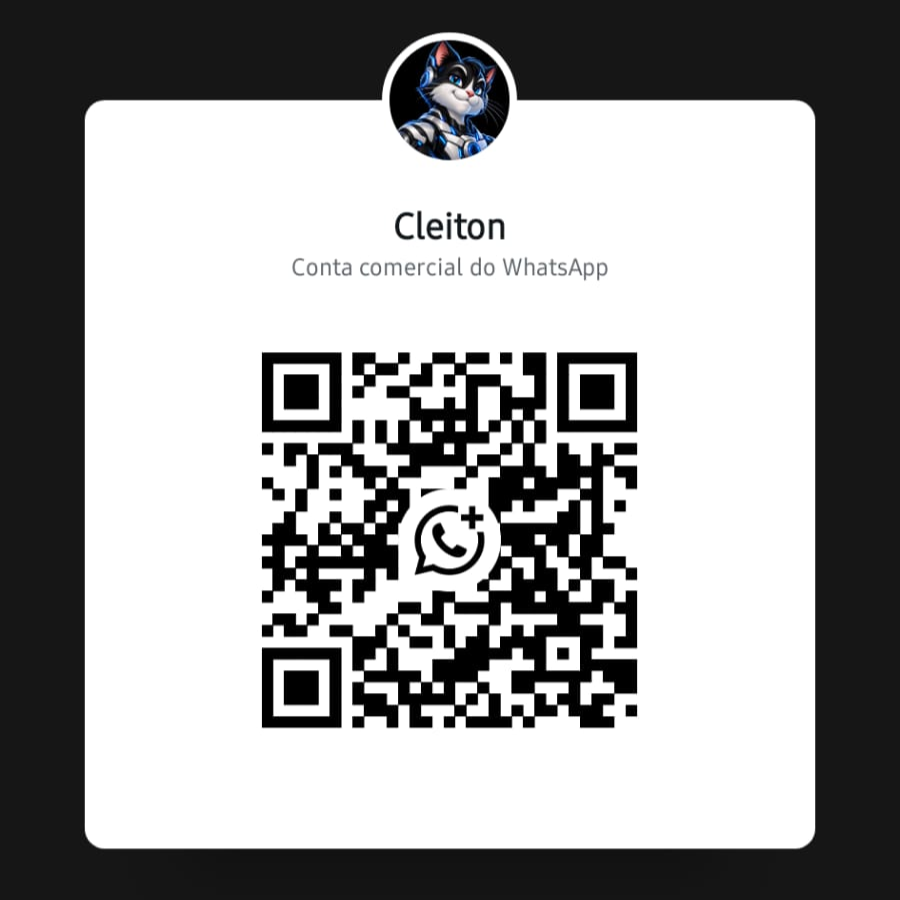

# Cleiton Bot

Bot de figurinhas para WhatsApp — envie uma mídia e receba a figurinha na hora.

## Adicionar o Cleiton

Escaneie o QR Code abaixo com a câmera do celular (ou pelo WhatsApp) para abrir uma conversa:



> Escaneie esse código para iniciar uma conversa com **Cleiton** no WhatsApp.

## Como usar

| Comando | O que faz |
|---------|-----------|
| `!s` · `!fig` · `!sticker` · `s` | Cria figurinha da mídia enviada ou citada |
| `!s Pacote \| Autor` | Define o nome do pacote e o autor da figurinha |
| `!menu` · `!ajuda` | Mostra a ajuda rápida |

### Passo a passo

1. Abra a conversa com o Cleiton (QR acima).
2. Se mandar qualquer texto sem comando (ex.: `oi`), o bot responde pedindo para usar `!ajuda`.
3. Digite `!ajuda` (ou `!menu`) para ver as instruções.
4. Envie uma **imagem**, **GIF** ou **vídeo** com a legenda `!s`.
5. Ou responda (reply) a uma mídia já enviada com `!s`.

Opcional — personalize o pacote e o autor:

```text
!s Meu Pacote | Meu Nome
```

### Limites

- Vídeos de até **30 segundos** (a figurinha usa cerca de **4,5 s**)
- Figurinhas estáticas e animadas no formato do WhatsApp (512×512)

---

Documentação técnica: [docs/](./docs/) · Licença: [MIT](./LICENSE) · © 2026 ZamohtExe
